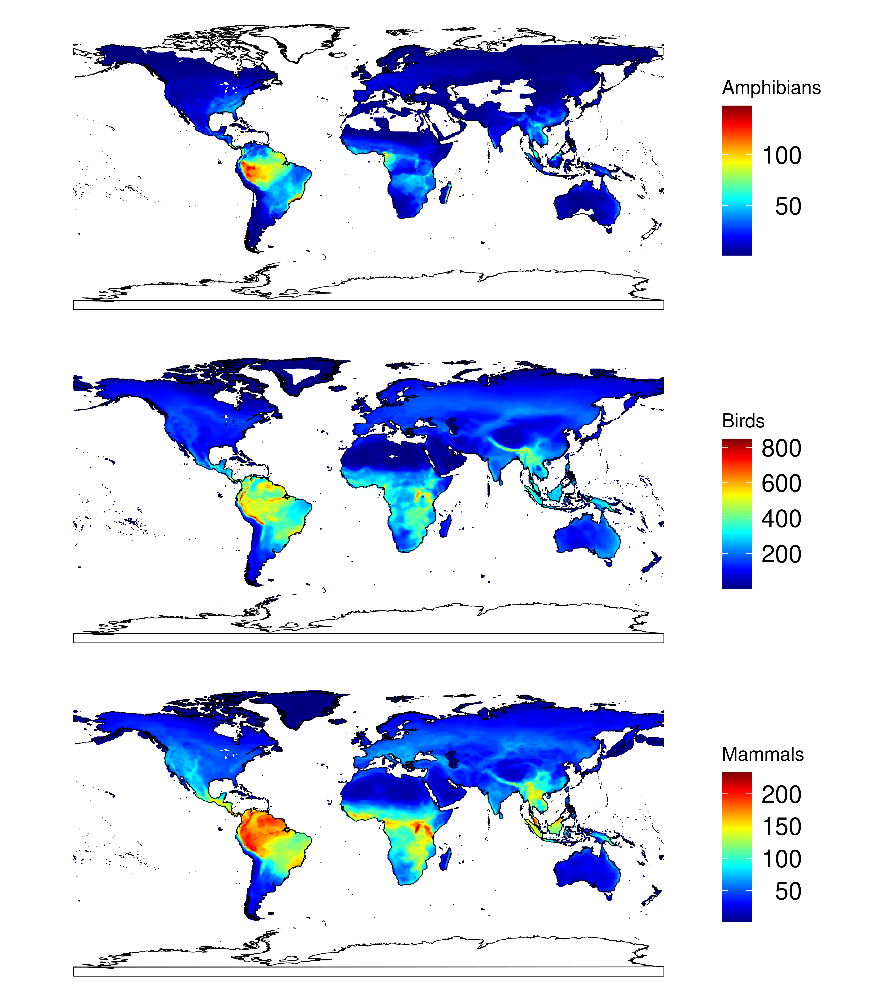
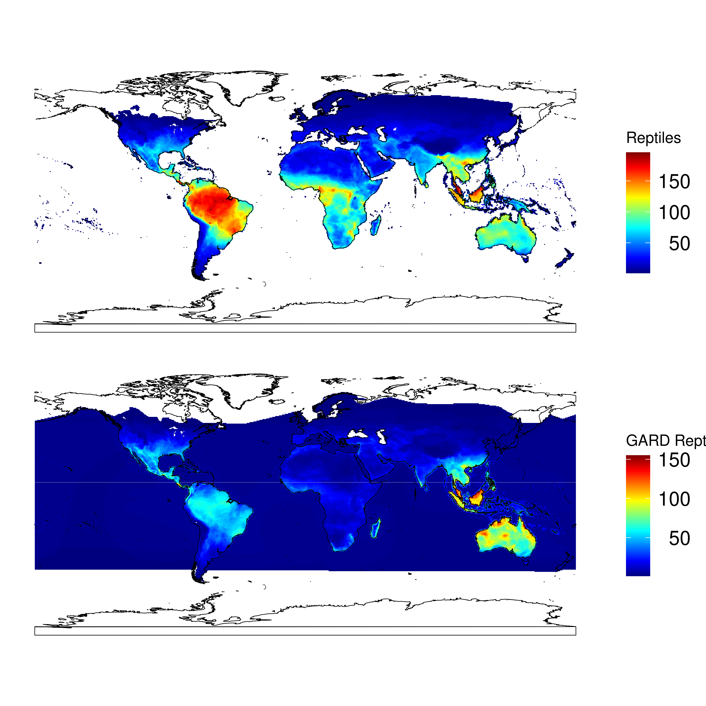
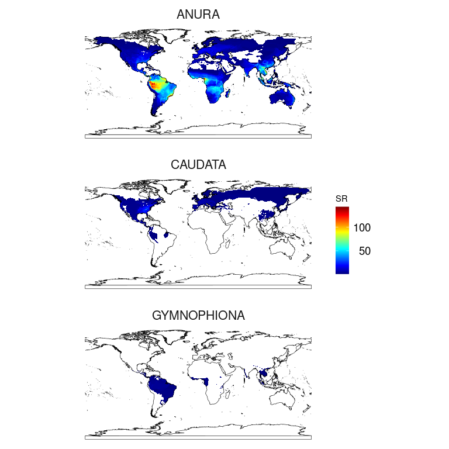
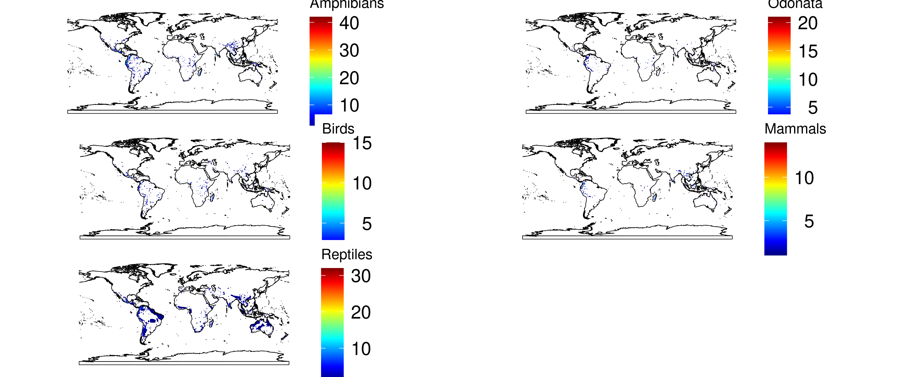
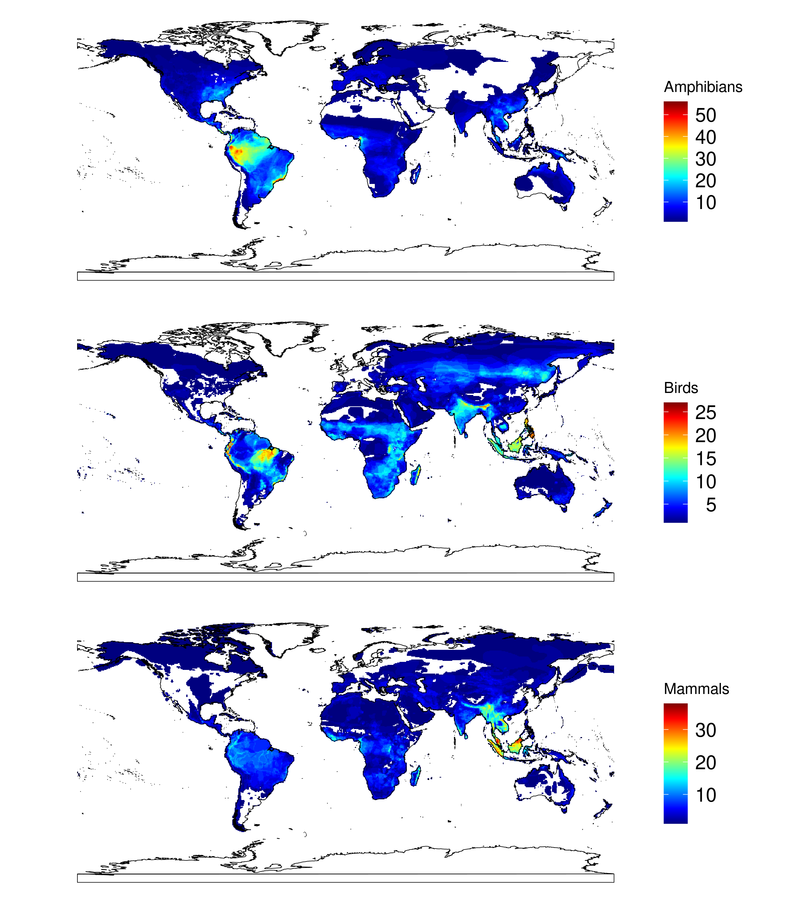
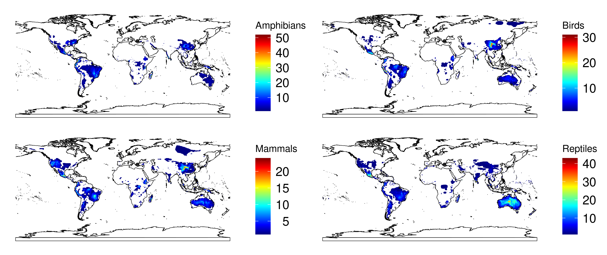
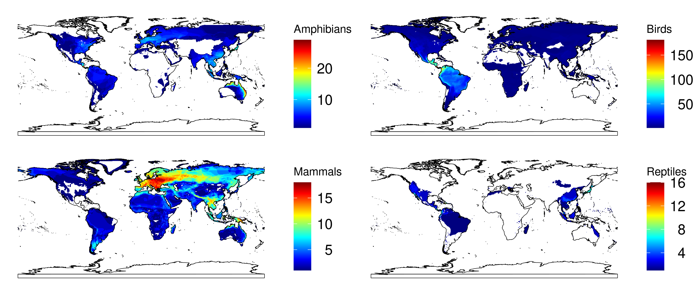

rasterSp: R Package to rasterize and summarise IUCN range maps
================

## R Setup

### Install rasterSp package

To *use* the package, you first have to install it from GitHub using the
`remotes` package.

``` r
# Install remotes if not previously installed
if(!"remotes" %in% installed.packages()[,"Package"]) install.packages("remotes")

# Install rasterSp from Github if not previously installed
if(!"rasterSp" %in% installed.packages()[,"Package"]) remotes::install_github("RS-eco/rasterSp", build_vignettes = T)
```

Load the rasterSp package

``` r
library(rasterSp)
```

**If you encounter a bug or if you have any problems, please file an
[issue](https://github.com/RS-eco/rasterSp/issues) on Github.**

## Species Data

The rasterSp package includes various rasterized species data. For
example, the bird distribution data can be loaded by:

``` r
data(ter_birds_dist)
```

**Note:** The code for how this data was created data can be found in
the data-raw folder.

### Specify path of file directory

``` r
filedir <- "/home/matt/Documents/"
```

**Note:** You need to adapt filedir according to the path on your
computer, where the IUCN Data is stored.

### Rasterize IUCN species shapefiles

IUCN data was downloaded from:
<https://www.iucnredlist.org/resources/spatial-data-download>, by
running the following code:

``` r
if(!dir.exists(paste0(filedir, "/IUCN/TERRESTRIAL_MAMMALS"))){
  download.file("http://spatial-data.s3.amazonaws.com/groups/TERRESTRIAL_MAMMALS.zip", 
                destfile = paste0(filedir, "/IUCN/TERRESTRIAL_MAMMALS.zip")) # <-- 594.3 MB
  unzip(paste0(filedir, "/IUCN/TERRESTRIAL_MAMMALS.zip"), exdir = paste0(filedir, "/IUCN"))
  unlink(paste0(filedir, "/IUCN/TERRESTRIAL_MAMMALS.zip"))
}
```

You have one shapefile for a group of animals, consisting of individual
polygons for each species.

Using the `rasterizeRange()` function, the spatial distribution of each
species is turned into a grid with a specific resolution. You can
specify the resolution in degrees, here we use 0.5°. If save = TRUE, the
grid for each species is saved to a GTiff file at the specified location
(see filepath argument).

**Please note:** If touches = TRUE, all cells touched by lines or
polygons are affected, not just those on the line render path, or whose
center point is within the polygon.

``` r
# Convert shape files into rasters and save to file
rasterizeRange(dsn=paste0(filedir, "/IUCN/AMPHIBIANS.shp"), 
               resolution=0.5, save=TRUE, touches=T,
               seasonal=c(1,2), origin=1, presence=c(1,2), 
               path=paste0(filedir, "/SpeciesData/"))

rasterizeRange(dsn=paste0(filedir, "/IUCN/FW_ODONATA_v6.2/FW_ODONATA.shp"), 
               resolution=0.5, save=TRUE, touches=T,
               seasonal=c(1,2), origin=1, presence=c(1,2), 
               path=paste0(filedir, "/SpeciesData/"))

rasterizeRange(dsn=paste0(filedir, "/IUCN/TERRESTRIAL_MAMMALS.shp"), 
               resolution=0.5, save=TRUE, touches=T,
               seasonal=c(1,2), origin=1, presence=c(1,2),
               path=paste0(filedir, "/SpeciesData/"))

rasterizeRange(dsn=paste0(filedir, "/IUCN/REPTILES.shp"), 
               resolution=0.5, save=TRUE, touches=T,
               seasonal=c(1,2), origin=1, presence=c(1,2), 
               path=paste0(filedir, "/SpeciesData/"))

rasterizeRange(dsn=paste0(filedir, "/IUCN/REPTILES_v6.3/REPTILES_PART1.shp"), 
               id="sci_name", resolution=0.5, save=TRUE, touches=T,
               seasonal=c(1,2), origin=1, presence=c(1,2), 
               path=paste0(filedir, "/ReptileData_v6.3/"))
rasterizeRange(dsn=paste0(filedir, "/IUCN/REPTILES_v6.3/REPTILES_PART2.shp"), 
               id="sci_name", resolution=0.5, save=TRUE, touches=T,
               seasonal=c(1,2), origin=1, presence=c(1,2), 
               path=paste0(filedir, "/ReptileData_v6.3/"))
```

### Rasterize BirdLife species shapefiles

Bird data was obtained from BirdLife. Currently we use the 2015 version,
which comes in form of individual shapefiles for each species. **Note:**
The `rasterizeRange` function can also handle a list of shapefiles.
<!-- 2015 BirdLife International data came from Christian (All.7z). -->

``` r
rasterizeRange(dsn=list.files(paste0(filedir, "/BirdLife/"), pattern=".shp", full.names=TRUE), 
               id="SCINAME", resolution=0.5, save=TRUE, touches=T,
               seasonal=c(1,2), origin=1, presence=c(1,2), 
               path=paste0(filedir, "/SpeciesData/"))
```

BirdLife as well as IUCN shapefiles provide information on a couple of
parameters (e.g. seasonal, origin and presence). These three parameters
are implemented in the `rasterizeRange` function, which then selects
only a specific subset of Polygons for each species. Infos on the
different parameters, can be found here:
<http://datazone.birdlife.org/species/spcdistPOS>.

### Birdlife 2018 data

The Birdlife 2018 data comes as gdb file, but can be converted in a
shapfile by:

``` r
library(rgdal)

# The input file geodatabase
gdb_file = paste0(filedir, "/BOTW.gdb")

# List all feature classes in a file geodatabase
subset(ogrDrivers(), grepl("GDB", name))
fc_list = ogrListLayers(gdb_file)
print(fc_list)

# Read the feature class
botw <- readOGR(dsn=gdb_file, layer="All_Species")

# Save as shapefile
writeOGR(botw, dsn=paste0(filedir, "/BirdLife_2018/"), layer="All_Species", driver="ESRI Shapefile")
```

In our case this was done in ArcMap, as it is much faster, although
using the `sf` package might increase the performance in R considerably.
The shapefile can then be loaded directly from file, by:

``` r
botw <- sf::st_read(dsn=paste0(filedir, "/BirdLife_2018/"), layer="All_Species")
```

## Rasterize GARD Reptile Data

GARD reptile data was downloaded from:
<https://datadryad.org/resource/doi:10.5061/dryad.83s7k> When using this
data, please cite the original publication:

Roll U, Feldman A, Novosolov M, Allison A, Bauer AM, Bernard R, Böhm M,
Castro-Herrera F, Chirio L, Collen B, Colli GR, Dabool L, Das I, Doan
TM, Grismer LL, Hoogmoed M, Itescu Y, Kraus F, LeBreton M, Lewin A,
Martins M, Maza E, Meirte D, Nagy ZT, de C. Nogueira C, Pauwels OSG,
Pincheira-Donoso D, Powney GD, Sindaco R, Tallowin OJS, Torres-Carvajal
O, Trape J, Vidan E, Uetz P, Wagner P, Wang Y, Orme CDL, Grenyer R,
Meiri S (2017) The global distribution of tetrapods reveals a need for
targeted reptile conservation. Nature Ecology & Evolution 1(11):
1677–1682. <https://doi.org/10.1038/s41559-017-0332-2>

Additionally, please cite the Dryad data package:

Meiri S, Roll U, Grenyer R, Feldman A, Novosolov M, Bauer AM (2017) Data
from: The global distribution of tetrapods reveals a need for targeted
reptile conservation. Dryad Digital Repository.
<https://doi.org/10.5061/dryad.83s7k>

``` r
rasterizeRange(dsn=paste0(filedir, "/GARD1.1_dissolved_ranges/modeled_reptiles.shp"),
               id="Binomial", resolution=0.5, save=TRUE, touches=T,
               path=paste0(filedir, "/GARD_SpeciesData/"))
```

## Calculate global species richness

The calcSR function uses a stepwise procedure to calculate the sum of
species for each grid cell. This means only two files are loaded into
memory at the same time to avoid memory shortage.

``` r
#Calculate amphibian richness
data(amphibians)
sr_amphibians <- calcSR(species_names=amphibians$binomial, path=paste0(filedir, "/SpeciesData/"))
raster::plot(sr_amphibians)
```

However, this approach takes quite a while and means we have to
recalculate the species richness everytime we change the species names.
A much faster way is to save the presence of each species as a data
frame and then only extract the species we are interested in. This is
shown further below.

## Calculate SR per Group

``` r
# Calulate amphibian SR
library(dplyr)
sr_amphibians <- amphibians_dist %>% mutate(group = "Amphibians", presence = 1) %>% 
  group_by(x, y, group) %>% summarise(sum = sum(presence))

# Calulate odonata SR
sr_odonata <- odonata_dist %>% mutate(group = "Odonata", presence = 1) %>% 
  group_by(x, y, group) %>% summarise(sum = sum(presence))

# Calulate terrestrial mammal SR
sr_ter_mammals <- ter_mammals_dist %>% mutate(group = "Mammals", presence = 1) %>% 
  group_by(x, y, group) %>% summarise(sum = sum(presence))

# Calulate terrestrial bird SR
sr_ter_birds <- ter_birds_dist %>% mutate(group = "Birds", presence = 1) %>% 
  group_by(x, y, group) %>% summarise(sum = sum(presence))

# Calulate reptile SR
sr_reptiles <- reptiles_dist %>% mutate(group = "Reptiles", presence = 1) %>% 
  group_by(x, y, group) %>% summarise(sum = sum(presence))

sr_gard_reptiles <- gard_reptiles_dist %>% mutate(group = "GARD_Reptiles", presence = 1) %>% 
  group_by(x, y, group) %>% summarise(sum = sum(presence))
```

## Plot global map of SR per taxa

``` r
library(ggmap2)
sr_alltaxa <- do.call(rbind, list(sr_amphibians, sr_ter_birds, sr_ter_mammals))
sr_alltaxa <- tidyr::spread(sr_alltaxa, group, sum)
ggmap2(sr_alltaxa, name=c("Amphibians", "Birds", "Mammals"), split=TRUE, ncol=1, country=T)
```

<!-- -->

## Plot global map of Reptile SR

``` r
library(ggmap2)
sr_rept <- do.call(rbind, list(sr_reptiles, sr_gard_reptiles))
sr_rept <- tidyr::spread(sr_rept, group, sum)
ggmap2(sr_rept, name=c("Reptiles", "GARD Reptiles"), split=TRUE, ncol=1, country=T)
```

<!-- -->

## Plot global map of Odonata SR

``` r
library(ggmap2)
sr_odonata <- tidyr::spread(sr_odonata, group, sum)
ggmap2(sr_odonata, name=c("Odonata"), ncol=1, country=T)
```

<!-- -->

## Calculate and plot SR by order or family

**Note:** Amphibian plot by order looks really weird and has a strange
z-axis value compared to the overall amphibian map

``` r
# Calculate the Amphibian SR per order
amphi_all <- left_join(amphibians_dist, amphibians[,c("binomial", "order_name")], 
                       by = c("species" = "binomial")) 

amphi_sum <- amphi_all %>% mutate(presence = 1) %>% group_by(x, y, order_name) %>% 
  summarise(sum = sum(presence)) %>% as.data.frame()

ggmap2(data=amphi_sum, name="SR", split=FALSE, long=TRUE, 
       subnames=unique(amphi_sum$order_name), ncol=1)
```

<!-- -->

## Calculate number of presences per species

Show distribution of number of presences per species

``` r
# Number of records per species
count_sp_amphibian <- amphibians_dist %>% mutate(group = "Amphibians", presence = 1) %>% 
  group_by(species, group) %>% summarise(sum = sum(presence))

count_sp_odonata <- odonata_dist %>% mutate(group = "Odonata", presence = 1) %>% 
  group_by(species, group) %>% summarise(sum = sum(presence))

count_sp_ter_mammal <- ter_mammals_dist %>% mutate(group = "Mammals", presence = 1) %>% 
  group_by(species, group) %>% summarise(sum = sum(presence))

count_sp_ter_bird <- ter_birds_dist %>% mutate(group = "Birds", presence = 1) %>% 
  group_by(species, group) %>%  summarise(sum = sum(presence))

count_sp_reptiles <- reptiles_dist %>% mutate(group = "Reptiles", presence = 1) %>% 
  group_by(species, group) %>% summarise(sum = sum(presence))

count_sp_gard_reptiles <- gard_reptiles_dist %>% mutate(group = "GARD_Reptiles", presence = 1) %>% 
  group_by(species, group) %>% summarise(sum = sum(presence))

# Combine counts per species into one dataframe
species_presences_alltaxa <- rbind(count_sp_amphibian, count_sp_odonata, count_sp_ter_bird, 
                                   count_sp_ter_mammal, count_sp_reptiles, count_sp_gard_reptiles)
rm(count_sp_amphibian, count_sp_odonata, count_sp_ter_mammal, count_sp_ter_bird, 
   count_sp_reptiles, count_sp_gard_reptiles)
```

Create Table with number of records per class and group

``` r
# Calculate number of records for each class (<10, 10-50, >50 records)
library(dplyr)
class1 <- species_presences_alltaxa %>% group_by(group) %>% filter(sum < 10) %>% summarise(n())
class2 <- species_presences_alltaxa %>% group_by(group) %>% filter(sum >= 10, sum <= 50) %>% summarise(n())
class3 <- species_presences_alltaxa %>% group_by(group) %>%  filter(sum > 50) %>% summarise(n())

sum_records <- Reduce(function(x,y) merge(x,y, by="group"), list(class1, class2, class3))
colnames(sum_records) <- c("Group", "n < 10", "10 <= n <= 50", "n > 50")

# Create table
knitr::kable(sum_records, style="markdown")
```

| Group         | n \< 10 | 10 \<= n \<= 50 | n \> 50 |
|:--------------|--------:|----------------:|--------:|
| Amphibians    |    3321 |            1475 |    1597 |
| Birds         |     896 |            1552 |    7451 |
| GARD_Reptiles |    3564 |            2520 |    3980 |
| Mammals       |     968 |            1021 |    3292 |
| Odonata       |     542 |             606 |     993 |
| Reptiles      |    2722 |            1595 |    2497 |

## Create plot of small ranging species (n \< 10)

``` r
#Calculate SR of for non-modelled species
library(dplyr)
sr_amphibians_smallrange <- amphibians_dist_smallrange %>% 
  group_by(x, y, group) %>% summarise(sum = sum(presence))
sr_odonata_smallrange <- odonata_dist_smallrange %>% 
  group_by(x, y, group) %>% summarise(sum = sum(presence))
sr_ter_birds_smallrange <- ter_birds_dist_smallrange %>% 
  group_by(x, y, group) %>% summarise(sum = sum(presence))
sr_ter_mammals_smallrange <- ter_mammals_dist_smallrange %>% 
  group_by(x, y, group) %>% summarise(sum = sum(presence))
sr_reptiles_smallrange <- reptiles_dist_smallrange %>% 
  group_by(x, y, group) %>% summarise(sum = sum(presence))

#Create plot of global richness per group
sr_alltaxa_smallrange <- do.call(rbind, list(sr_amphibians_smallrange, sr_odonata_smallrange,
                                             sr_ter_birds_smallrange, sr_ter_mammals_smallrange,
                                             sr_reptiles_smallrange))
sr_alltaxa_smallrange <- tidyr::spread(sr_alltaxa_smallrange, group, sum)
data(outline, package="ggmap2")
ggmap2::ggmap2(sr_alltaxa_smallrange, name=c("Amphibians", "Odonata", "Birds", "Mammals", "Reptiles"), 
               split=TRUE, ncol=2, country=T)
```

<!-- -->

## Threatened species (according to IUCN Red List)

Plot SR of threatened species

``` r
#Calculate SR of for threatened species
sr_amphibians_threatened <- amphibians_threatened %>% mutate(group = "Amphibians", presence=1) %>% 
  group_by(x, y, group) %>% summarise(sum = sum(presence))
sr_ter_mammals_threatened <- ter_mammals_threatened %>% mutate(group = "Mammals", presence=1) %>% 
  group_by(x, y, group) %>% summarise(sum = sum(presence))
sr_ter_birds_threatened <- ter_birds_threatened %>% mutate(group = "Birds", presence=1) %>% 
  group_by(x, y, group) %>% summarise(sum = sum(presence))

sr_alltaxa_threatened <- do.call(rbind, list(sr_amphibians_threatened, 
                                             sr_ter_birds_threatened, 
                                             sr_ter_mammals_threatened))
sr_alltaxa_threatened <- tidyr::spread(sr_alltaxa_threatened, group, sum)
library(ggmap2)
ggmap2(sr_alltaxa_threatened, name=c("Amphibians", "Birds", "Mammals"), 
       split=TRUE, ncol=1, country=T)
```

<!-- -->

## Endemic species (by country)

Create dataframe of species data, which only occur in one country. And
add country to species data.

``` r
#Rasterize country shapefile
data(countriesHigh, package="rworldxtra")
data(landseamask_generic, package="rISIMIP")
countries <- raster::rasterize(countriesHigh, landseamask_generic, 
                               field="SOV_A3")
countries <- data.frame(raster::rasterToPoints(countries))
colnames(countries) <- c("x", "y", "country")

# Identify species that only occur in one country
amphibians_endemic <- amphibians_dist %>% left_join(countries) %>% 
  group_by(species) %>% summarise(n = n_distinct(country)) %>% 
  filter(n == 1)
ter_mammals_endemic <- ter_mammals_dist %>% left_join(countries) %>% 
  group_by(species) %>% summarise(n = n_distinct(country)) %>% 
  filter(n == 1)
ter_birds_endemic <- ter_birds_dist %>% left_join(countries) %>% 
  group_by(species) %>% summarise(n = n_distinct(country)) %>% 
  filter(n == 1)
reptiles_endemic <- reptiles_dist %>% left_join(countries) %>% 
  group_by(species) %>% summarise(n = n_distinct(country)) %>% 
  filter(n == 1)

# Subset species by endemism
amphibians_dist_endemic <- amphibians_dist %>%   
  filter(species %in% amphibians_endemic$species)
ter_mammals_dist_endemic <- ter_mammals_dist %>% 
  filter(species %in% ter_mammals_endemic$species)
ter_birds_dist_endemic <- ter_birds_dist %>% 
  filter(species %in% ter_birds_endemic$species)
reptiles_dist_endemic <- reptiles_dist %>% 
  filter(species %in% reptiles_endemic$species)

# Calculate SR of endemic species
library(dplyr)
sr_amphibians_endemic <- amphibians_dist_endemic %>% mutate(group = "Amphibians", presence = 1) %>% 
  group_by(x, y, group) %>% summarise(sum = sum(presence))
sr_ter_mammals_endemic <- ter_mammals_dist_endemic %>% mutate(group = "Mammals", presence = 1) %>% 
  group_by(x, y, group) %>% summarise(sum = sum(presence))
sr_ter_birds_endemic <- ter_birds_dist_endemic %>% mutate(group = "Birds", presence = 1) %>% 
  group_by(x, y, group) %>% summarise(sum = sum(presence))
sr_reptiles_endemic <- reptiles_dist_endemic %>% mutate(group = "Reptiles", presence = 1) %>% 
  group_by(x, y, group) %>% summarise(sum = sum(presence))

# Plot SR of endemics
sr_alltaxa_endemic <- do.call(rbind, list(sr_amphibians_endemic, 
                                          sr_ter_birds_endemic, 
                                          sr_ter_mammals_endemic,
                                          sr_reptiles_endemic))
sr_alltaxa_endemic <- tidyr::spread(sr_alltaxa_endemic, group, sum)
library(ggmap2)
ggmap2(sr_alltaxa_endemic, name=c("Amphibians", "Birds", "Mammals", "Reptiles"), 
       split=TRUE, ncol=2, country=T)
```

<!-- -->

## Endemic species (by range size)

``` r
# Load endemic species names
data(amphibians_endemic)
data(ter_mammals_endemic)
data(ter_birds_endemic)
data(reptiles_endemic)

# Calculate SR of endemic species
sr_amphibians_endemic <- amphibians_dist %>% filter(species %in% amphibians_endemic$species_name) %>% 
  mutate(group = "Amphibians", presence = 1) %>% group_by(x, y, group) %>% summarise(sum = sum(presence))
sr_ter_mammals_endemic <- ter_mammals_dist %>% filter(species %in% ter_mammals_endemic$species_name) %>% 
  mutate(group = "Mammals", presence = 1) %>% group_by(x, y, group) %>% summarise(sum = sum(presence))
sr_ter_birds_endemic <- ter_birds_dist %>% filter(species %in% ter_birds_endemic$species_name) %>% 
  mutate(group = "Birds", presence = 1) %>% group_by(x, y, group) %>% summarise(sum = sum(presence))
sr_reptiles_endemic <- reptiles_dist %>% filter(species %in% reptiles_endemic$species_name) %>% 
  mutate(group = "Reptiles", presence = 1) %>% 
  group_by(x, y, group) %>% summarise(sum = sum(presence))

# Plot SR of endemics
sr_alltaxa_endemic <- do.call(rbind, list(sr_amphibians_endemic, 
                                          sr_ter_birds_endemic, 
                                          sr_ter_mammals_endemic,
                                          sr_reptiles_endemic))
sr_alltaxa_endemic <- tidyr::spread(sr_alltaxa_endemic, group, sum)
library(ggmap2)
ggmap2(sr_alltaxa_endemic, name=c("Amphibians", "Birds", "Mammals", "Reptiles"), split=TRUE, ncol=2, country=T)
```

<!-- -->

## Invasive species

To assess the invasiveness of species ranges, see the corresponding
`vignette("iucn-invasions")`.
